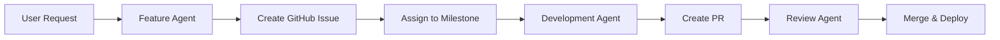
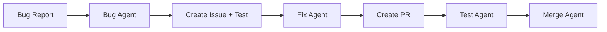

# GitHub-Centric Agent Workflow

> Aligning our multi-agent system with GitHub's development process

## Agent-to-GitHub Mapping

### 1. **Issue Management Agents**

#### Feature Request Agent (`agent-feature-request`)
- **GitHub Integration**: Creates issues with `enhancement` label
- **Responsibilities**:
  - Parse feature requests from users
  - Create detailed GitHub issues
  - Assign to appropriate milestone
  - Tag relevant developers

#### Bug Hunter Agent (`agent-bug-hunter`)
- **GitHub Integration**: Creates issues with `bug` label
- **Responsibilities**:
  - Analyze bug reports
  - Create reproducible test cases
  - Link to relevant code sections
  - Suggest priority level

### 2. **Pull Request Agents**

#### Code Review Agent (`agent-code-review`)
- **GitHub Integration**: Reviews PRs automatically
- **Responsibilities**:
  - Check code quality
  - Verify tests pass
  - Ensure documentation updated
  - Comment on PR with suggestions

#### Merge Manager Agent (`agent-merge-manager`)
- **GitHub Integration**: Manages PR merging
- **Responsibilities**:
  - Check merge conflicts
  - Ensure CI/CD passes
  - Auto-merge approved PRs
  - Update related issues

### 3. **Documentation Agents**

#### Docs Writer Agent (`agent-docs-writer`)
- **GitHub Integration**: Updates wiki and README
- **Responsibilities**:
  - Generate API documentation
  - Update changelog
  - Create usage examples
  - Maintain wiki pages

#### Release Notes Agent (`agent-release-notes`)
- **GitHub Integration**: Creates release notes
- **Responsibilities**:
  - Aggregate merged PRs
  - Generate changelog
  - Create GitHub release
  - Tag versions properly

### 4. **Sync Agents**

#### NPM-GitHub Sync Agent (`agent-npm-sync`)
- **GitHub Integration**: Ensures NPM matches GitHub
- **Responsibilities**:
  - Trigger on GitHub releases
  - Publish to NPM automatically
  - Verify version consistency
  - Update package registries

#### Cross-Repo Sync Agent (`agent-cross-repo`)
- **GitHub Integration**: Syncs related repositories
- **Responsibilities**:
  - Update dependencies
  - Propagate security fixes
  - Maintain consistency

## GitHub Workflow Implementation

### Step 1: Feature Request Flow



### Step 2: Bug Fix Flow



## GitHub API Integration

Each agent uses GitHub's REST API:

```javascript
const { Octokit } = require("@octokit/rest");

class GitHubAgent {
  constructor(token) {
    this.octokit = new Octokit({ auth: token });
  }

  async createIssue(title, body, labels) {
    return await this.octokit.issues.create({
      owner: 'AiGent47-DevLabs',
      repo: 'Grok-Code-CLI',
      title,
      body,
      labels
    });
  }

  async createPR(title, body, branch) {
    return await this.octokit.pulls.create({
      owner: 'AiGent47-DevLabs',
      repo: 'Grok-Code-CLI',
      title,
      body,
      head: branch,
      base: 'main'
    });
  }
}
```

## Agent Assignment Rules

### Based on Issue Labels:
- `enhancement` → Feature Development Agent
- `bug` → Bug Fix Agent
- `documentation` → Docs Agent
- `security` → Security Agent
- `performance` → Optimization Agent

### Based on PR Content:
- `/src` changes → Test Agent review
- `/docs` changes → Docs Agent review
- `package.json` changes → Dependency Agent
- Security files → Security Agent

## Automation Triggers

### On Issue Created:
1. Triage Agent analyzes issue
2. Assigns appropriate labels
3. Routes to correct agent
4. Updates project board

### On PR Created:
1. Test Agent runs test suite
2. Code Review Agent analyzes
3. Docs Agent checks documentation
4. Security Agent scans

### On Release Tagged:
1. Release Agent creates notes
2. NPM Sync Agent publishes
3. Docs Agent updates version
4. Notification Agent alerts users

## Best Practices Reference

Following:
- [GitHub Flow](https://docs.github.com/en/get-started/quickstart/github-flow)
- [Semantic Versioning](https://semver.org/)
- [Conventional Commits](https://www.conventionalcommits.org/)
- [OpenAI's Multi-Agent Guidelines](https://platform.openai.com/docs/guides/agents)

## Configuration

```yaml
# .github/agents.yml
agents:
  feature_agent:
    triggers:
      - issue_labeled: enhancement
    actions:
      - create_branch
      - assign_developer
      - create_pr_template
      
  bug_agent:
    triggers:
      - issue_labeled: bug
    actions:
      - create_test_case
      - find_related_code
      - suggest_fix
      
  release_agent:
    triggers:
      - tag_created: v*
    actions:
      - generate_changelog
      - create_release
      - publish_npm
      - notify_users
```

## Implementation Priority

1. **Phase 1**: Issue Management Agents
2. **Phase 2**: PR Automation Agents  
3. **Phase 3**: Release & Sync Agents
4. **Phase 4**: Advanced Analysis Agents

This structure ensures every GitHub action has a corresponding agent, creating a fully automated development workflow!