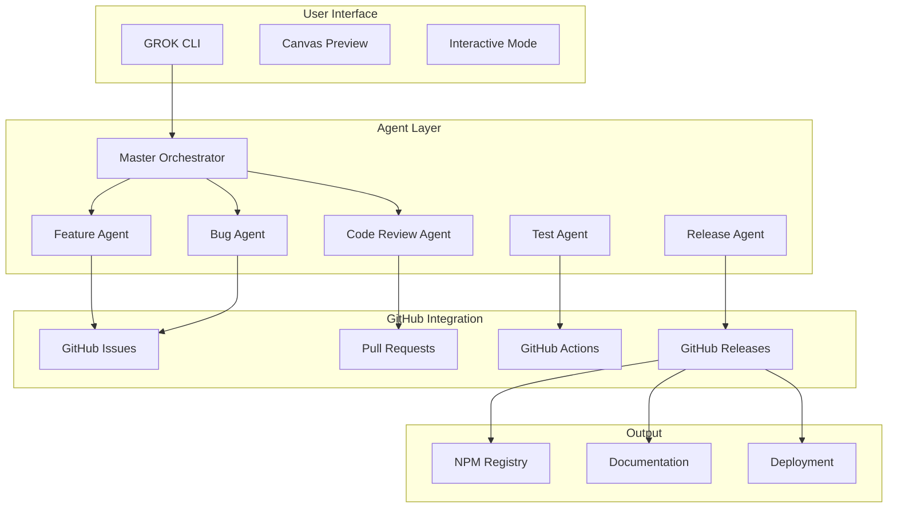

# GROK CLI Implementation Guide

> Following GitHub Flow and Anthropic's agent best practices

## Overview

GROK CLI uses a GitHub-centric multi-agent system that automates the entire development workflow from feature request to production deployment.

## Architecture



## Workflow Implementation

### 1. Feature Request Flow

```yaml
# When user says: "I want feature X"
1. GROK CLI → Feature Agent
2. Feature Agent → Creates GitHub Issue
3. GitHub Actions → Assigns to milestone
4. Development Agent → Creates branch
5. Code Generation → Creates PR
6. Review Agent → Reviews code
7. Test Agent → Runs tests
8. Merge Agent → Merges to main
9. Release Agent → Publishes
```

### 2. Bug Fix Flow

```yaml
# When user reports: "There's a bug in Y"
1. GROK CLI → Bug Agent
2. Bug Agent → Creates issue with test case
3. GitHub Actions → Labels as bug
4. Fix Agent → Identifies problem
5. Code Generation → Creates fix
6. Test Agent → Verifies fix
7. Review Agent → Approves
8. Auto-merge → Deploys fix
```

### 3. Canvas Preview Usage

```bash
# Preview HTML visualizations
grok /canvas earth-simulation.html

# Preview JavaScript graphics
grok /canvas three-js-demo.js

# Preview Python plots
grok /canvas data-visualization.py
```

## Agent Configuration

### Master Orchestrator Setup

```javascript
// agents/master-orchestrator.js
class MasterOrchestrator {
  constructor() {
    this.agents = {
      feature: new FeatureAgent(),
      bug: new BugAgent(),
      review: new ReviewAgent(),
      test: new TestAgent(),
      release: new ReleaseAgent()
    };
  }

  async handleRequest(request) {
    const { type, data } = this.analyzeRequest(request);
    
    switch(type) {
      case 'feature':
        return await this.agents.feature.process(data);
      case 'bug':
        return await this.agents.bug.process(data);
      case 'review':
        return await this.agents.review.process(data);
    }
  }

  analyzeRequest(request) {
    // Use AI to categorize request
    if (request.includes('want') || request.includes('feature')) {
      return { type: 'feature', data: request };
    }
    if (request.includes('bug') || request.includes('error')) {
      return { type: 'bug', data: request };
    }
    // ... more analysis
  }
}
```

### GitHub Integration

```javascript
// agents/github-integration.js
const { Octokit } = require("@octokit/rest");

class GitHubIntegration {
  constructor(token) {
    this.octokit = new Octokit({ auth: token });
    this.owner = 'AiGent47-DevLabs';
    this.repo = 'Grok-Code-CLI';
  }

  async createFeatureIssue(title, description, agent) {
    const issue = await this.octokit.issues.create({
      owner: this.owner,
      repo: this.repo,
      title: `[Feature] ${title}`,
      body: `## Feature Request\n\n${description}\n\n---\n*Created by ${agent.id}*`,
      labels: ['enhancement', 'agent-created'],
      assignees: [agent.assignee]
    });

    return issue.data;
  }

  async createPullRequest(branch, title, body, agent) {
    const pr = await this.octokit.pulls.create({
      owner: this.owner,
      repo: this.repo,
      title: title,
      body: `${body}\n\n---\n*Generated by ${agent.id}*`,
      head: branch,
      base: 'main',
      draft: false
    });

    return pr.data;
  }

  async runWorkflow(workflowId, inputs) {
    await this.octokit.actions.createWorkflowDispatch({
      owner: this.owner,
      repo: this.repo,
      workflow_id: workflowId,
      ref: 'main',
      inputs
    });
  }
}
```

## Canvas Preview Implementation

The canvas preview system provides real-time visualization for:

1. **HTML Files**: Direct browser preview
2. **JavaScript**: Wrapped in canvas-enabled HTML
3. **Python**: Matplotlib/Plotly visualization

### Usage Examples

```javascript
// Earth simulation preview
grok "Create 3D Earth simulation"
// After code generation:
grok /canvas earth.html

// Data visualization
grok "Visualize stock data with Python"
// After code generation:
grok /canvas stocks.py
```

## Best Practices

### 1. Conventional Commits
```bash
feat: Add canvas preview
fix: Resolve API timeout
docs: Update agent workflow
chore: Bump dependencies
```

### 2. Semantic Versioning
- Major: Breaking changes
- Minor: New features
- Patch: Bug fixes

### 3. GitHub Flow
- Main branch always deployable
- Feature branches for development
- PR reviews before merge
- Automated testing on all PRs

### 4. Agent Communication
```yaml
# Agent message format
message:
  from: feature-agent-001
  to: master-orchestrator
  type: task_complete
  data:
    issue_number: 123
    pr_number: 456
    status: ready_for_review
```

## Deployment

### Automated Release Process

```yaml
# .github/workflows/release.yml
on:
  push:
    tags:
      - 'v*'

jobs:
  release:
    steps:
      - Create GitHub Release
      - Publish to NPM
      - Update documentation
      - Notify users
```

### Manual Release

```bash
# Complete release process
npm run release

# This runs:
# 1. Tests
# 2. Version bump
# 3. Git commit & tag
# 4. Push to GitHub
# 5. Publish to NPM
```

## Monitoring

### Agent Performance Dashboard

```javascript
// Monitor agent activity
const dashboard = {
  agents: {
    active: 5,
    idle: 2,
    failed: 0
  },
  tasks: {
    completed: 47,
    in_progress: 3,
    queued: 12
  },
  github: {
    open_issues: 8,
    open_prs: 3,
    releases_this_week: 2
  }
};
```

## Security

### Agent Permissions

```yaml
# Minimal permissions per agent
feature_agent:
  - issues:write
  - contents:read
  
bug_agent:
  - issues:write
  - pull_requests:write
  
release_agent:
  - contents:write
  - packages:write
```

## Troubleshooting

### Common Issues

1. **Agent not responding**
   - Check GitHub token permissions
   - Verify webhook configuration
   - Review agent logs

2. **Canvas preview not working**
   - Ensure port 8888 is available
   - Check file permissions
   - Verify dependencies installed

3. **Auto-update failing**
   - Check npm permissions
   - Verify network connectivity
   - Review update logs

## Future Enhancements

1. **Voice Control**: "Hey GROK, create a dashboard"
2. **Multi-repo Support**: Manage multiple projects
3. **Team Collaboration**: Shared agent workflows
4. **AI Model Fine-tuning**: Project-specific training

This implementation guide ensures GROK CLI follows industry best practices while providing powerful automation through its multi-agent system.