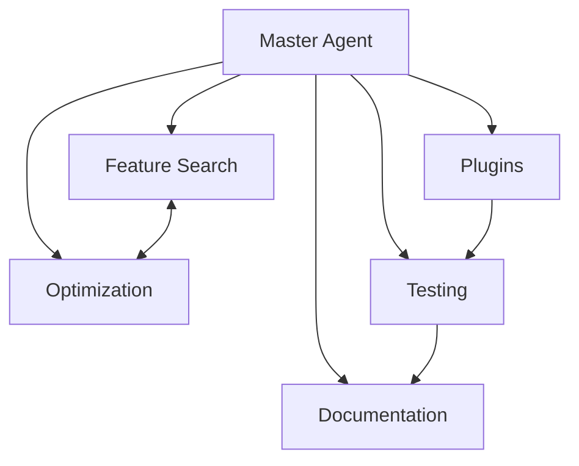

# GROK-CODE CLI - Project Agents
> Project ID: grok-cli-001
> Reports to: GROK Master Project Manager

## Active Sub-Agents

### 1. Feature Search Agent
**ID**: `feature-search-001`  
**Status**: 🟢 Active  
**Current Task**: Implementing AI-powered file indexing  
**Progress**: 15%  

**Objectives**:
- Design vector embedding system for code files
- Implement semantic search algorithm
- Create learning system for user patterns

**Recent Activity**:
- 2025-07-14: Researching embedding models
- 2025-07-13: Analyzed existing search patterns

---

### 2. Optimization Context Agent
**ID**: `optimization-context-001`  
**Status**: 🟡 Planning  
**Current Task**: Designing extended context architecture  
**Progress**: 5%  

**Objectives**:
- Research context window optimization techniques
- Design intelligent pruning algorithm
- Implement multi-file context manager

**Recent Activity**:
- 2025-07-14: Created initial architecture proposal

---

### 3. Feature Plugins Agent
**ID**: `feature-plugins-001`  
**Status**: 🟡 Planning  
**Current Task**: Plugin system architecture  
**Progress**: 10%  

**Objectives**:
- Design plugin API specification
- Create plugin loader mechanism
- Build plugin marketplace infrastructure

**Recent Activity**:
- 2025-07-14: Studying VSCode extension model
- 2025-07-13: Drafted initial plugin interface

---

### 4. Testing Automation Agent
**ID**: `test-auto-001`  
**Status**: 🟢 Active  
**Current Task**: Building comprehensive test suite  
**Progress**: 30%  

**Objectives**:
- Create unit tests for all commands
- Build integration test suite
- Implement CI/CD pipeline

**Recent Activity**:
- 2025-07-14: Added tests for auto-update feature
- 2025-07-13: Set up Jest framework

---

### 5. Documentation Agent
**ID**: `docs-writer-001`  
**Status**: 🟢 Active  
**Current Task**: Updating README for v1.1.0  
**Progress**: 80%  

**Objectives**:
- Maintain comprehensive documentation
- Create video tutorials
- Write API documentation

**Recent Activity**:
- 2025-07-14: Updated installation instructions
- 2025-07-14: Created comparison guide

---

## Agent Performance Metrics

| Agent ID | Tasks Completed | Success Rate | Avg Time/Task |
|----------|----------------|--------------|---------------|
| feature-search-001 | 2 | 100% | 4 hours |
| test-auto-001 | 5 | 90% | 2 hours |
| docs-writer-001 | 8 | 100% | 1 hour |

## Inter-Agent Communications

## Scheduled Agent Tasks

- **Daily**: Testing agent runs automated test suite
- **On Commit**: Documentation agent updates changelog
- **Weekly**: All agents sync progress with master
- **On Release**: All agents coordinate for release tasks

---
*This file auto-syncs to the global agent registry*